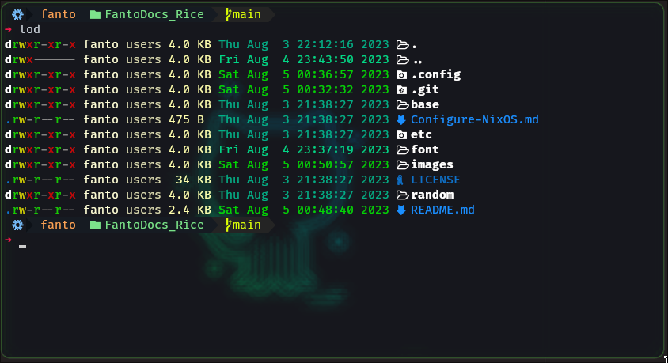

# Kitty Console Configuration

<p align="center">
    
</p>

## Installation

- You can install kitty on NixOS using the following command:

```shell
nix-env -iAv nixos.kitty
```

- Or add into your nixos configuration file like below:

```shell
enviroment.systemPackages = with pkgs; [
    kitty
];
```

## Configuration 

- The directory of my configuration is in `~/.config/kitty`
- My configuration is in the **kitty.conf** file in this folder
- my Kitty theme is in the **Github.conf** file in this folder 

## Prompt Configuration

- We are going to use [oh-my-posh](oh-my-posh/README.md) to configure the terminal.
