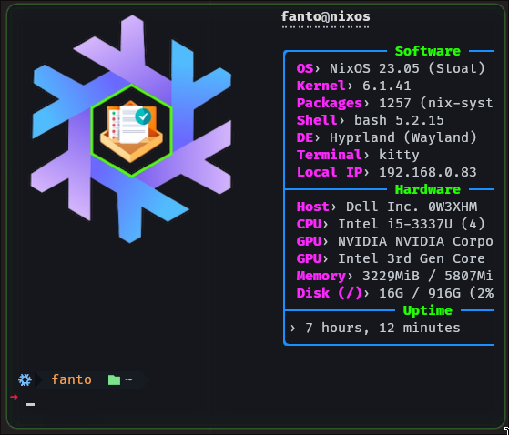

# Neofetch

<p align="center">
    
</p>

Neofetch show the informations from the system, highly configurable

## Installation

- In NixOS you can install on the system with this command:

```shell
nix-env -iAv nixos.neofetch
```

- You can install too adding the neofetch with the programs in the `etc/nixos/configuration.nix`

```shell
environment.systemPackages = with pkgs; [
    neofetch
  ];
```

## Configuration

- My configuration is in the `config.conf` in this directory.