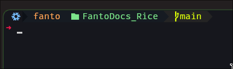

# Oh-my-posh configuration

<p align="center">
    
</p>

## Bashrc configuration

- First before go to oh-my-posh you need to have the following file into your home (~) folder:

```shell
~/.bashrc
``` 

- My configuration file is in this folder with the name `.bashrc`
- To reload after changed something run the following command:

```shell
source ~/.bashrc
```

- Use the configuration from the file in this repo and copy and paste into your `~/.bashrc` file from your OS

## Oh-my-posh

### Download oh-my-posh

- First download the unzip

```shell
nix-env -iAv nixos.unzip
```

- Then install oh-my-posh

```shell
nix-env -iAv nixos.oh-my-posh
```

- To check if it was installed

```shell
eval "$(oh-my-posh init bash)"
```

### Configuration

- The configuration is in the following location: `~/.config/oh-my-posh/`
- Add the file `fantodocs.omp.json` from this repo into the location above
- After that, insert in the end of the `~/.bashrc` the following command:

```shell
eval "$(oh-my-posh init bash --config ~/.config/oh-my-posh/fantodocs.omp.json)"
```