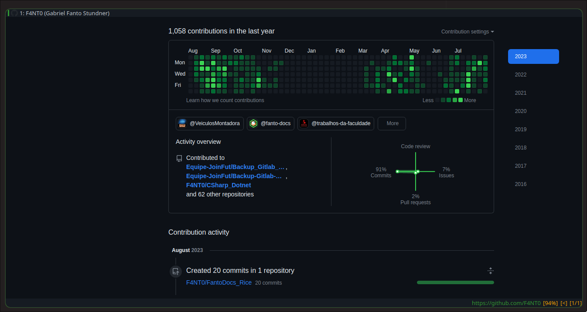

# Minimalist Browser Qutebrowser

<p align="center">
  
</p>

## Install

- In NixOS just add the Qutebrowser into the `configuration.nix`:

```shell
environment.systemPackages = with pkgs; [
    qutebrowser
  ];
```

## Configuration

- `config.py` have all the configs available to use in qutebrowser
- `github-colors.css` have the theme used into qutebrowser

## Keyboard Shortcuts

TBD

## Commands

TBD