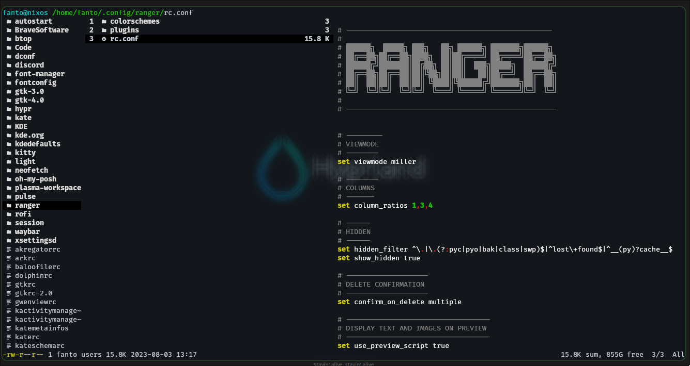

# Ranger configuration

<p align="center">
    
</p>

## Instalation

- To install Ranger into nixOS use the following command:

```shell
nix-env -iAv nixos.ranger
```

- or install by configuration.nix directly:

```nix
enviroment.systemPackages = with pkgs; [
    ranger
];
```

## Image vizualization

- Website of Ranger: [https://ranger.github.io/](https://ranger.github.io/)

- in NixOS there's a problem showing images, need to activate use of images and change the default image viewer w3m to kitty

```shell
set preview_images true
set preview_images_method kitty
```

## Colorschemes

- add the `Github.py` file inside the `~/.config/ranger/colorschemes`

## Plugins

- add the `devicons.py` and `__init__.py` file inside the `~/.config/ranger/plugins`
- add in the end of the `rc.conf` the following code:

```shell
default_linemode devicons
```

## Highlight code

- You can see code files into ranger, to show highlight of this code just install `highlight`

```shell
nix-env -iAv nixos.highlight
```

- When you open again ranger, the files are going to show highlighted.


