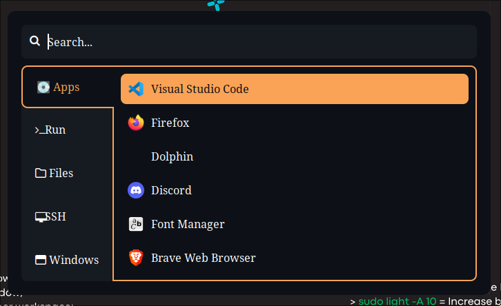

# Rofi configuration

<p align="center">
    
</p>

- Rofi is a linux program to select a program or command installed into the system.

- The location of the configuration is: `~/.config/rofi/config.rasi`
- The theme location is: `~/.config/rofi/github-theme.rasi`

## Installation

- To install this program use the following command:

```shell
nix-env -iAv nixos.rofi
```

Or add the program into the _etc/nixos/configuration.nix_ file:

```shell
environment.systemPackages = with pkgs; [
    rofi
];
```

## My Configuration

- See the file `config.rasi` to see all the configuration well idented
- See the file `github-theme.rasi` to see my color configuration