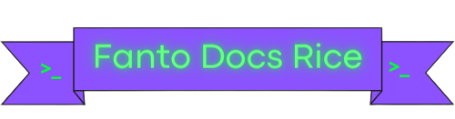

  

  

  
   

---

## Programs

|Name|Link|Config|Install
|---|---|---|---|
btop|[Btop Github]()|[My Config]()|`nix-env -iAv nixos.btop`
light|[light Github]()|`sudo light -U(-A) 30 decrease(increase) light to 30`|`nix-env -iAv nixos.light`

- Vscode install: `NIXPKGS_ALLOW_UNFREE=1 nix-env -iA nixos.vscode`
- Discord install: `NIXPKGS_ALLOW_UNFREE=1 nix-env -iA nixos.discord`
