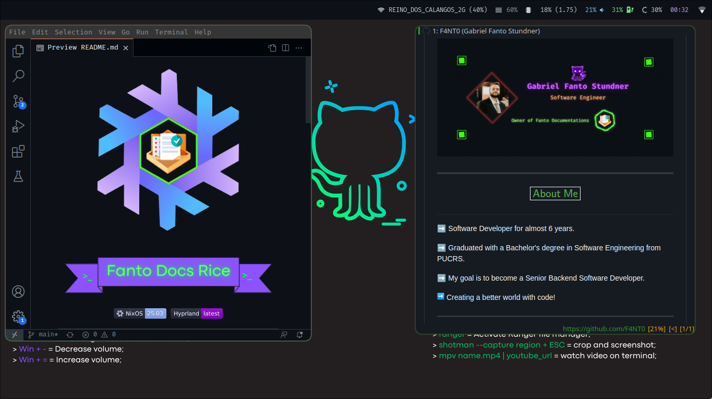

  

  

  
   

---

# $$\boxed{\sf\color{lightblue}Screenshots}$$

  

  

  

---

## My OS configuration

- The configurations to make work the OS and WM

|Name|My Doc|Original Repo
|---|---|---|
hyprland|[Hyprland config](https://github.com/F4NT0/FantoDocs_Rice/blob/main/.config/hypr/hyprland.conf)|[Hyprland Github](https://github.com/hyprwm/Hyprland)
nixos|[NixOS config](https://github.com/F4NT0/FantoDocs_Rice/blob/main/etc/nixos/configuration.nix)|[NixOS Github](https://github.com/NixOS/nixpkgs)

## Program configurations

- The programs I use and change the basic configurations

|Name|My Doc|Original Repo|status documentation
|---|---|---|---|
btop|[Btop config](https://github.com/F4NT0/FantoDocs_Rice/tree/main/.config/btop)|[Btop Github](https://github.com/aristocratos/btop)|$\sf\color{orange}Almost \space done$
kitty|[Kitty config](https://github.com/F4NT0/FantoDocs_Rice/tree/main/.config/kitty)|[Kitty Github](https://github.com/kovidgoyal/kitty)|$\sf\color{lightgreen}OK$
ranger|[Ranger config](https://github.com/F4NT0/FantoDocs_Rice/tree/main/.config/ranger)|[Ranger Github](https://github.com/ranger/ranger)|$\sf\color{lightgreen}OK$
rofi|[Rofi config](https://github.com/F4NT0/FantoDocs_Rice/tree/main/.config/rofi)|[Rofi Github](https://github.com/davatorium/rofi)|$\sf\color{lightgreen}OK$
oh-my-posh|[OhMyPosh config](https://github.com/F4NT0/FantoDocs_Rice/tree/main/.config/oh-my-posh)|[Oh-my-posh Github](https://github.com/jandedobbeleer/oh-my-posh)|$\sf\color{lightgreen}OK$
qutebrowser|[Qutebrowser config](https://github.com/F4NT0/FantoDocs_Rice/tree/main/.config/qutebrowser)|[Qutebrowser Github](https://github.com/qutebrowser/qutebrowser)|$\sf\color{orange}Almost \space done$
neofetch|[Neofetch config](https://github.com/F4NT0/FantoDocs_Rice/tree/main/.config/neofetch)|[Neofetch Github](https://github.com/Chick2D/neofetch-themes/tree/main)|$\sf\color{lightgreen}OK$
dunst|[Dunst config](https://github.com/F4NT0/FantoDocs_Rice/tree/main/.config/dunst)|[Dunst Github](https://github.com/dunst-project/dunst)|$\sf\color{orange}Almost \space done$
Fish Shell|[Fish Shell Config](https://github.com/F4NT0/FantoDocs_Rice/tree/main/.config/fish)|[Fish Github](https://github.com/fish-shell/fish-shell)|$\sf\color{lightgreen}OK$
Nvchad Neovim|[Nvchad Config](https://github.com/F4NT0/FantoDocs_Rice/tree/main/.config/nvim)|[NvChad Github](https://github.com/NvChad/NvChad)|$\sf\color{orange}Almost \space done$

## Basic Programs

- Programs that I use but I don't change the configurations

|Name|My Doc|Original Repo|status documentation
|---|---|---|---|
light|[Light Doc](https://github.com/F4NT0/FantoDocs_Rice/tree/main/base/light/README.md)|[Light Github](http://haikarainen.github.io/light/)|$\sf\color{lightgreen}OK$
lsd|[Lsd Doc](https://github.com/F4NT0/FantoDocs_Rice/tree/main/base/light/README.md)|[Lsd Github](https://github.com/lsd-rs/lsd)|$\sf\color{lightgreen}OK$
shotman|[Shotman Doc](https://github.com/F4NT0/FantoDocs_Rice/tree/main/base/shotman/README.md)|[Shotman Git](https://git.sr.ht/~whynothugo/shotman)|$\sf\color{lightgreen}OK$
tuigreet|[Tuigreet Doc](https://github.com/F4NT0/FantoDocs_Rice/tree/main/base/tuigreet/README.md)|[Tuigreet Git](https://github.com/apognu/tuigreet)|$\sf\color{lightgreen}OK$

## Other programs (for my workflow)

- Vscode install: `NIXPKGS_ALLOW_UNFREE=1 nix-env -iA nixos.vscode`
- Discord install: `NIXPKGS_ALLOW_UNFREE=1 nix-env -iA nixos.discord`

## Github Colors used

  

