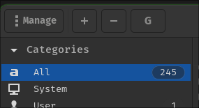
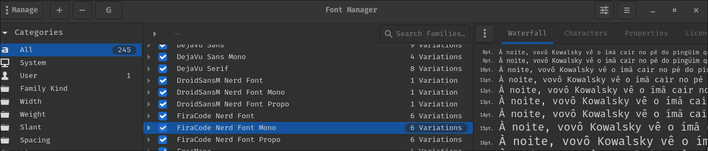
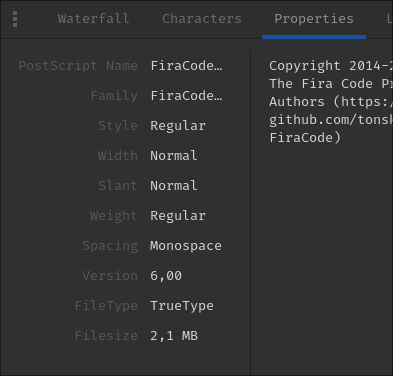
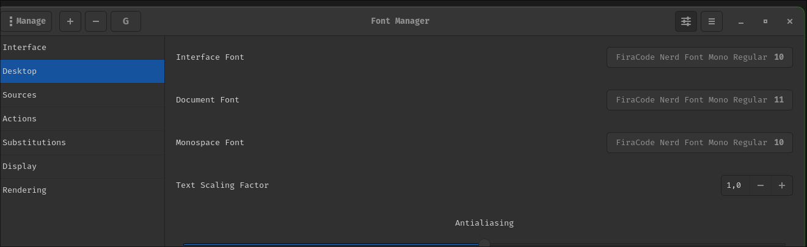
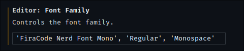
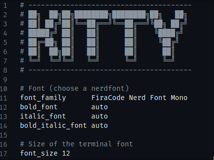
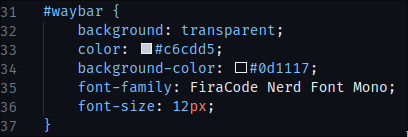
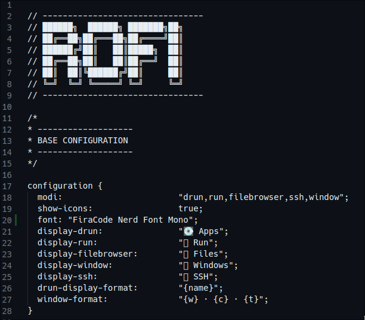

# How to install and manage fonts on Linux

## Install a font

- You can download any font, I like the `FiraCode Nerd Font Mono` from this directory

## Manage a font

- Install the font-manager software:

```shell
nix-env -iAv nixos.font-manager
```

- Install a font clicking into the plus symbol and adding the _.ttf_ file

<p align="center">
    
</p>

- Find your font into the list

<p align="center">
    
</p>

- You can see all the infos from the font

<p align="center">
    
</p>

- Select into the top left the config symbol and choose the fonts you want to add into the system

<p align="center">
    
</p>

## Add into VSCode

- To add the font into the VSCode you need to put this code into the font setting:

<p align="center">
    
</p>

## Add into Kitty Terminal

- Change the name of the font like below

<p align="center">
    
</p>

## Add into Waybar

- You can change the font into the `style.css` file

<p align="center">
    
</p>

## Add into Rofi

- You can change the font into `config.rasi` file

<p align="center">
    
</p>
